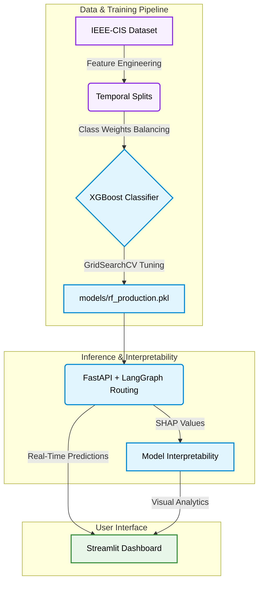

<div align="center">

# Agentic-Fraud-Sentinel

**A production-grade fraud detection system using XGBoost classifiers with LangGraph-based multi-agent routing, strict class balancing weights, and a real-time FastAPI backend.**

[](https://www.python.org/)
[](https://xgboost.readthedocs.io/)
[](https://python.langchain.com/docs/langgraph)
[](https://fastapi.tiangolo.com/)
[](https://streamlit.io/)

</div>

---

## Architecture Overview



The platform processes the standard **IEEE-CIS Dataset** (590k transactions) through a multi-stage pipeline.

---

## Features

| Component | Description |
|---|---|
| **Data & Feature Engineering** | Performs time-based splitting (by `TransactionDT`) to simulate real-world data drift. Implements rolling aggregates, frequency encoding, missingness flags, and class weights to balance representation (3.5% to 10% fraud). |
| **Agentic ML Core** | Trains an XGBoost classifier tuned via Optuna. Inference requests are routed intelligently via LangGraph agents to decide if a transaction needs manual review or automatic block based on SHAP values. |
| **Interpretability Layer** | Uses SHAP (SHapley Additive exPlanations) to generate per-prediction feature attribution for model transparency and interpretability. |
| **Deployment Services** | Fully containerized environment featuring a FastAPI backend (`/predict`) powered by LangGraph, and a real-time Streamlit monitoring dashboard. |

---

## Model Performance Metrics

| Optimization Stage | AUC-ROC | AUC-PR | Precision | Recall | F1 Score |
|:---|:---:|:---:|:---:|:---:|:---:|
| **XGBoost Baseline** | 0.9012 | 0.5246 | 0.8007 | 0.3253 | 0.4626 |
| **Optuna Tuned XGBoost** | 0.9070 | 0.5758 | 0.8335 | 0.3942 | 0.5352 |
| **Optimal Threshold** (0.216) | 0.9070 | 0.5758 | 0.6990 | 0.4845 | 0.5723 |

**Key Exploratory Data Analysis (EDA) Insights:**
- Fraud rate is strictly non-stationary, ranging from 2%–4.8% over a 185-day window.
- Handled 214 high-cardinality features with >50% missing values via strict missingness flags.
- `TransactionAmt` alone is an extremely weak signal; 4 out of 6 engineered behavioral features dominate the feature importance rankings.

---

## Technology Stack

| Component | Technologies |
|:---|:---|
| **Data Processing** | `pandas`, `numpy`, `scikit-learn` |
| **Imbalanced Learning** | `Class Weights Integration` |
| **Machine Learning** | `XGBoost`, `Scikit-learn` |
| **Hyperparameter Tuning** | `Optuna`, `Cross-Validation` |
| **Interpretability** | `SHAP` |
| **Agentic Routing** | `LangGraph`, `LangChain` |
| **API & Serving** | `FastAPI`, `uvicorn` |
| **Frontend & Visualization** | `Streamlit`, `Matplotlib`, `Plotly` |
| **Containerization** | `Docker` |

---

## Project Structure

```text
Agentic-Fraud-Sentinel/
├── data/
│   ├── raw/                  # IEEE-CIS source CSVs
│   └── processed/            # Engineered, split, balanced data
├── notebooks/
│   ├── eda.ipynb             # Exploratory Data Analysis
│   ├── preprocessing.ipynb   # Feature engineering pipelines
│   ├── model.ipynb           # Model training & tuning
│   └── evaluation.ipynb      # Model evaluation & analysis
├── src/
│   ├── data/                 # Data pipelines
│   ├── models/               # Training & evaluation scripts
│   └── interpretability/     # Feature importance analysis
├── api/
│   └── main.py               # FastAPI application
├── dashboard/
│   └── app.py                # Streamlit monitoring UI
├── Dockerfile                # Container configuration
└── requirements.txt          # Python dependencies
```

---

## Setup & Execution

### 1. Environment Initialization
```bash
git clone https://github.com/Shashank17singh/Agentic-Fraud-Sentinel.git
cd Agentic-Fraud-Sentinel
python -m venv venv
source venv/bin/activate      # Linux/Mac
venv\Scripts\activate         # Windows
pip install -r requirements.txt
```

### 2. Dataset Ingestion
Download the IEEE-CIS Fraud Detection dataset from [Kaggle](https://www.kaggle.com/c/ieee-fraud-detection). Place the raw files in the `data/raw/` directory:
- `data/raw/train_transaction.csv`
- `data/raw/train_identity.csv`

### 3. Deployment
*(Update this section with your deployment instructions or Cloud Provider details once live).*
- **API URL:** https://agentic-fraud-sentinel.onrender.com/docs
- **Dashboard URL:** [Your Streamlit Cloud URL]

---

## CI/CD Pipeline

This repository is equipped with a GitHub Actions workflow (`.github/workflows/ci.yml`). Every push to the `main` branch triggers:
1. **Formatting Checks**: Ensures compliance with `black` and `isort`.
2. **Linting**: Runs `flake8` to catch syntax errors and undefined variables.
3. **Unit Tests**: Executes the `pytest` suite to ensure API and model stability.